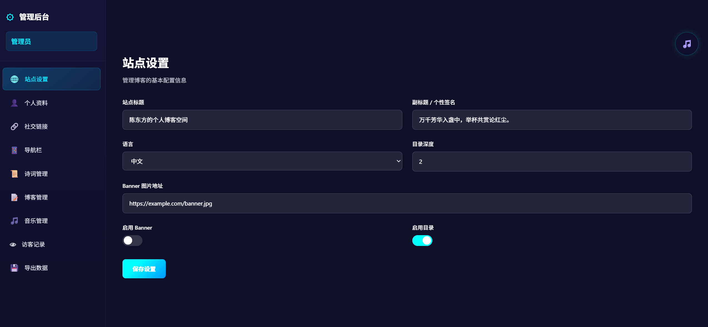

# 陈东方的个人博客

 
 


基于 [Fuwari](https://github.com/saicaca/fuwari) 主题深度定制的赛博国风个人博客，部署在独立服务器上，支持 GitHub Actions 自动化 CI/CD。

**线上地址**：[https://yunxing.fun](https://yunxing.fun)

---

## 效果预览

### 首页


### 诗词展示


### 音乐播放器


### 留言板


### 管理面板



---

## 核心功能

| 功能 | 说明 |
|------|------|
| 赛博国风主题 | 深色赛博朋克 + 国风配色，毛玻璃导航栏，粒子动画 |
| 诗词展示 | 85首古诗词，古卷展开 + 赛博朋克风格 |
| 音乐播放器 | 黑胶唱片旋转动画，Web Audio API 可视化 |
| 评论系统 | IP 限流，localStorage 回退，支持多页面评论 |
| 留言板 | 独立页面，访客可留言 |
| 管理面板 | 8个标签页（站点/个人/社交/导航/诗词/文章/音乐/访客），密码保护 |
| 访客统计 | API 计数，分页展示 |
| 搜索 | Pagefind 静态搜索 |
| RSS | 自动生成 |
| SEO | robots.txt, sitemap |

---

## 技术栈

- **前端框架**：Astro + Tailwind CSS + Svelte
- **样式**：赛博国风主题色（`#00f0ff` / `#ff2d95` / `#b44dff`）
- **API 服务器**：Node.js + Express
- **部署**：GitHub Actions CI/CD + Nginx + Supervisor
- **服务器**：Ubuntu, Node.js v20

---

## 部署架构

```
本地 git push → GitHub Actions → pnpm build → rsync 上传 → Supervisor 重启 → 上线
```

请求链路：

```
用户浏览器 → Nginx (80端口) → 反向代理 → serve (8080) → 静态文件
```

---

## 本地开发

```bash
# 安装依赖
pnpm install

# 启动开发服务器
pnpm exec astro dev --host 127.0.0.1 --port 8899

# 构建生产版本
pnpm build
```

---

## 项目结构

```
fuwari/
├── src/
│   ├── components/      # 组件（Navbar、MusicPlayer、CommentSection 等）
│   ├── pages/           # 页面路由（首页、诗词、留言板、管理面板）
│   ├── content/posts/   # 博客文章（Markdown）
│   ├── data/            # 诗词数据、站点数据
│   ├── layouts/         # 布局（粒子动画、扫描线、加载动画）
│   └── styles/          # 赛博国风主题样式
├── public/
│   ├── data/            # 静态数据（评论、音乐、诗词）
│   └── music/           # 音乐文件
├── api-server.js        # Node.js API 服务器
└── .github/workflows/   # GitHub Actions 部署脚本
```

---

## 管理面板

访问 `https://yunxing.fun/admin/`，输入密码进入后台。

支持管理：站点配置、个人信息、社交链接、导航栏、诗词、文章、音乐上传、访客统计。

---

## 许可证

MIT License
